# 🏗️ Architecture Documentation

This document provides a comprehensive overview of the Voxtral Realtime Transcription application architecture, including system components, data flows, and implementation details.

## 📋 Table of Contents

1. [System Overview](#system-overview)
2. [Architecture Diagrams](#architecture-diagrams)
3. [Component Details](#component-details)
4. [Data Flow](#data-flow)
5. [Technology Stack](#technology-stack)
6. [Deployment Options](#deployment-options)

---

## System Overview

The Voxtral Realtime Transcription application is a web-based system that enables real-time speech-to-text transcription using AI models. It supports two deployment modes:

1. **GPU Mode**: Uses Mistral AI's Voxtral-Mini-4B-Realtime-2602 model via vLLM
2. **CPU Mode**: Uses Vosk for CPU-compatible real-time transcription

---

## Architecture Diagrams

### High-Level System Architecture

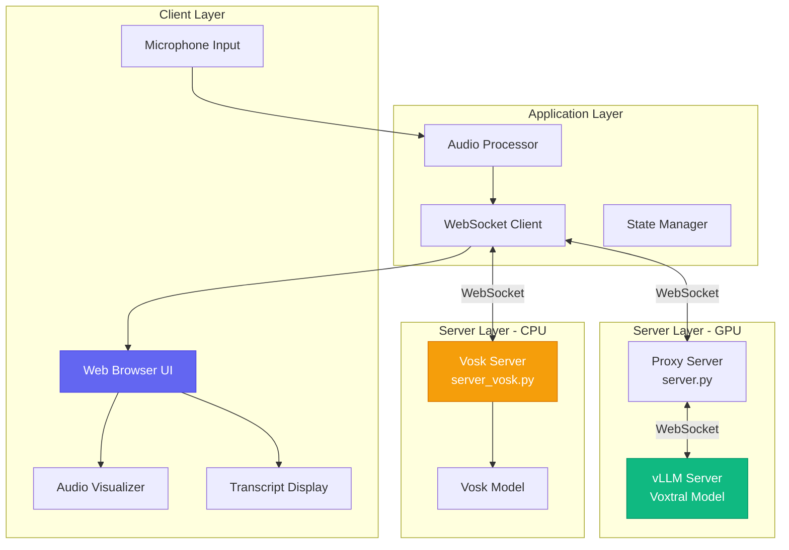

### GPU Mode - Detailed Architecture

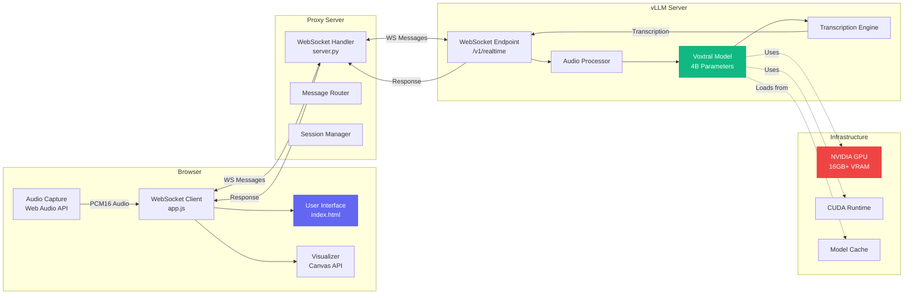

### CPU Mode - Detailed Architecture

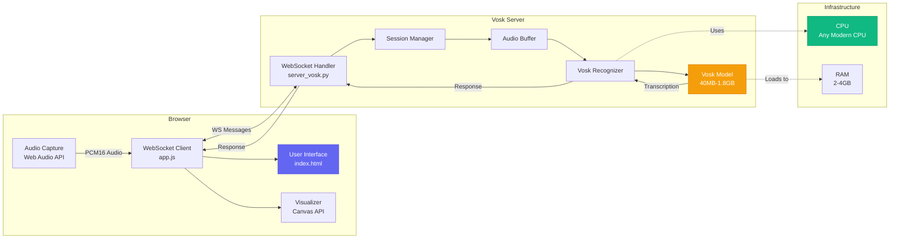

### WebSocket Communication Flow

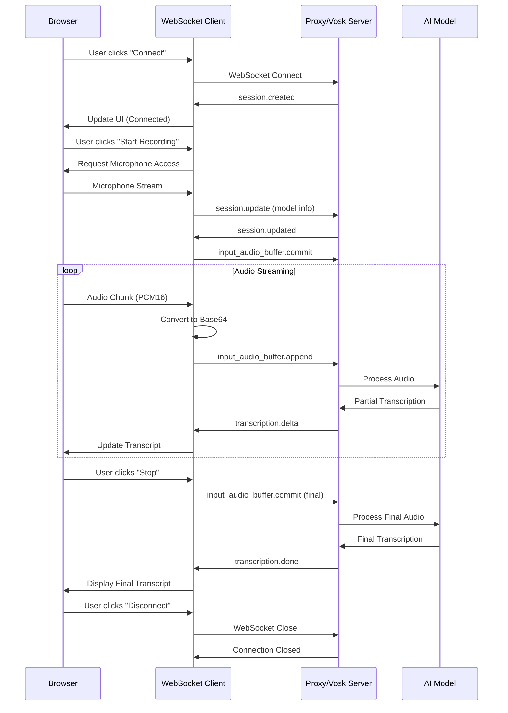

### Audio Processing Pipeline

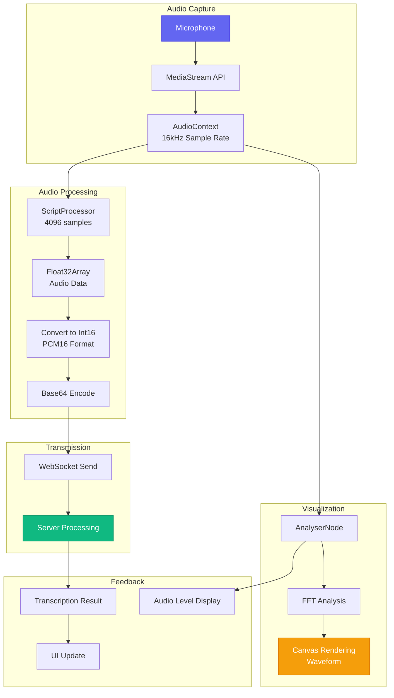

### Message Protocol Flow

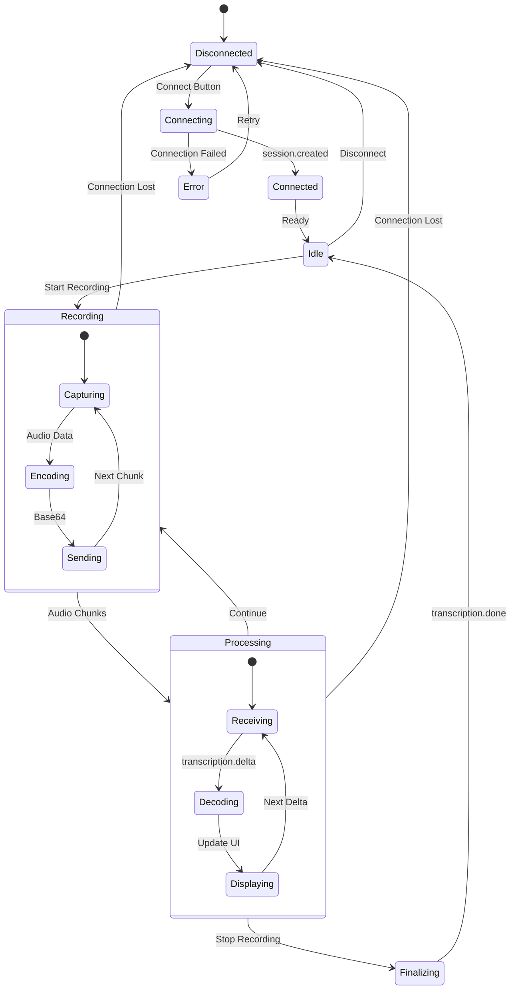

### Deployment Architecture - GPU Mode

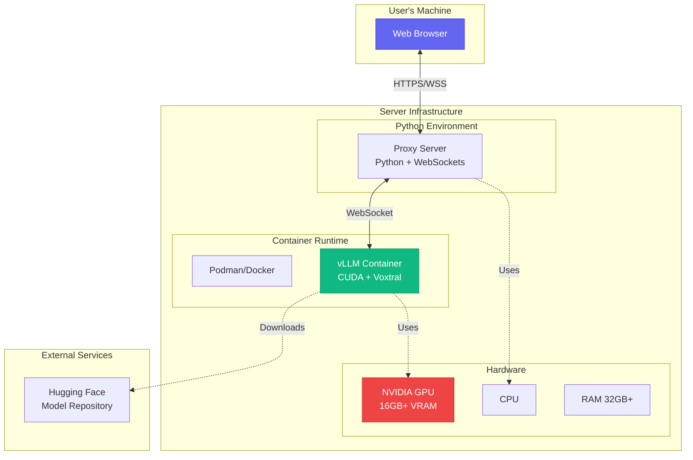

### Deployment Architecture - CPU Mode

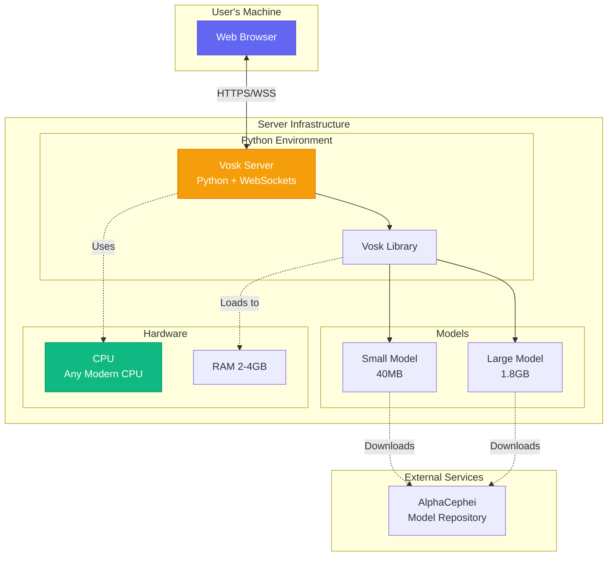

---

## Component Details

### Frontend Components

#### 1. User Interface (`index.html`)
- **Purpose**: Main application interface
- **Features**:
  - Connection settings panel
  - Audio source selection
  - Control buttons (Connect, Start, Stop, Clear)
  - Real-time transcription display
  - Statistics dashboard
  - System logs viewer
- **Technologies**: HTML5, Semantic markup

#### 2. Styling (`style.css`)
- **Purpose**: Visual design and theming
- **Features**:
  - Dark theme with gradient backgrounds
  - Responsive grid layout
  - Animated status indicators
  - Custom scrollbars
  - Button hover effects
- **Technologies**: CSS3, Flexbox, Grid

#### 3. Client Application (`app.js`)
- **Purpose**: Client-side logic and WebSocket communication
- **Key Classes**:
  - `VoxtralClient`: Main application controller
- **Responsibilities**:
  - WebSocket connection management
  - Audio capture and processing
  - Real-time visualization
  - UI state management
  - Statistics tracking
- **Technologies**: JavaScript ES6+, Web Audio API, WebSocket API

### Backend Components

#### 1. GPU Proxy Server (`server.py`)
- **Purpose**: Bridge between web client and vLLM server
- **Key Classes**:
  - `VoxtralServer`: WebSocket proxy handler
- **Responsibilities**:
  - Client connection management
  - Message forwarding (bidirectional)
  - Session tracking
  - Error handling
- **Technologies**: Python 3.9+, websockets, asyncio

#### 2. CPU Vosk Server (`server_vosk.py`)
- **Purpose**: Direct transcription using Vosk
- **Key Classes**:
  - `VoskTranscriptionServer`: WebSocket handler with Vosk integration
- **Responsibilities**:
  - Audio buffer management
  - Real-time recognition
  - Partial result streaming
  - Session management
- **Technologies**: Python 3.9+, websockets, vosk, asyncio

#### 3. vLLM Server (External)
- **Purpose**: Run Voxtral model for transcription
- **Deployment**: Podman/Docker container
- **Requirements**: NVIDIA GPU, CUDA
- **Endpoint**: `/v1/realtime` (WebSocket)

---

## Data Flow

### Audio Data Flow

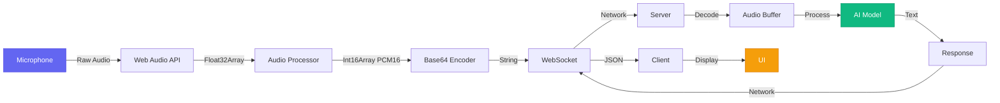

### Message Types

#### Client → Server

1. **session.update**
   ```json
   {
     "type": "session.update",
     "model": "mistralai/Voxtral-Mini-4B-Realtime-2602"
   }
   ```

2. **input_audio_buffer.append**
   ```json
   {
     "type": "input_audio_buffer.append",
     "audio": "base64_encoded_pcm16_data"
   }
   ```

3. **input_audio_buffer.commit**
   ```json
   {
     "type": "input_audio_buffer.commit",
     "final": true
   }
   ```

#### Server → Client

1. **session.created**
   ```json
   {
     "type": "session.created",
     "id": "session-12345",
     "model": "voxtral-mini-4b",
     "object": "realtime.session"
   }
   ```

2. **transcription.delta**
   ```json
   {
     "type": "transcription.delta",
     "delta": "partial transcription text",
     "object": "realtime.transcription.delta"
   }
   ```

3. **transcription.done**
   ```json
   {
     "type": "transcription.done",
     "text": "complete transcription text",
     "usage": {
       "tokens": 150,
       "duration": 5.2
     }
   }
   ```

---

## Technology Stack

### Frontend Stack

| Component | Technology | Version | Purpose |
|-----------|-----------|---------|---------|
| UI Framework | Vanilla HTML5 | - | Structure |
| Styling | CSS3 | - | Design |
| Client Logic | JavaScript ES6+ | - | Functionality |
| Audio API | Web Audio API | - | Audio capture |
| Communication | WebSocket API | - | Real-time messaging |
| Visualization | Canvas API | - | Waveform display |

### Backend Stack - GPU Mode

| Component | Technology | Version | Purpose |
|-----------|-----------|---------|---------|
| Language | Python | 3.9+ | Server logic |
| WebSocket | websockets | 12.0+ | Communication |
| Async | asyncio | Built-in | Concurrency |
| Model Server | vLLM | Latest | Model inference |
| Container | Podman/Docker | Latest | Deployment |
| GPU Runtime | CUDA | 11.8+ | GPU acceleration |

### Backend Stack - CPU Mode

| Component | Technology | Version | Purpose |
|-----------|-----------|---------|---------|
| Language | Python | 3.9+ | Server logic |
| WebSocket | websockets | 12.0+ | Communication |
| ASR Engine | Vosk | 0.3.45+ | Speech recognition |
| Async | asyncio | Built-in | Concurrency |

---

## Deployment Options

### Option 1: Local Development

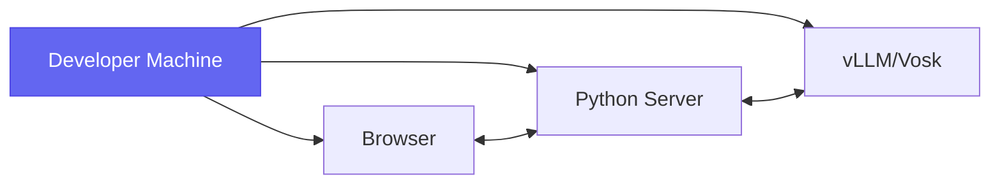

### Option 2: Client-Server Split

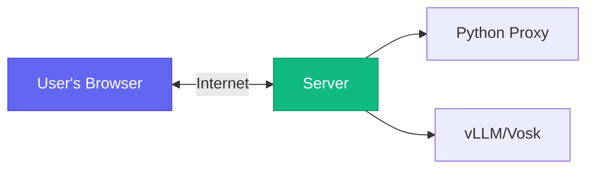

### Option 3: Cloud Deployment

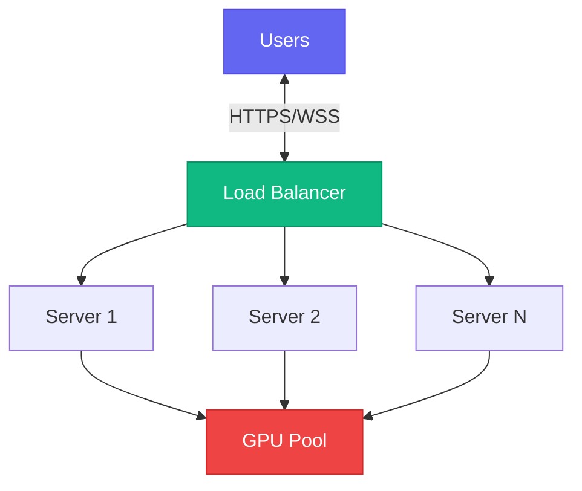

---

## Performance Characteristics

### GPU Mode (Voxtral)

| Metric | Value | Notes |
|--------|-------|-------|
| Latency | <500ms | End-to-end |
| Throughput | Real-time | 1x audio speed |
| Accuracy | 95-98% | English |
| GPU Memory | 4-6GB | VRAM usage |
| Languages | 13 | Multilingual |

### CPU Mode (Vosk)

| Metric | Value | Notes |
|--------|-------|-------|
| Latency | 500ms-2s | End-to-end |
| Throughput | Real-time | 1x audio speed |
| Accuracy | 85-95% | Depends on model |
| CPU Usage | 20-40% | Modern CPUs |
| Languages | 20+ | Multiple models |

---

## Security Considerations

1. **WebSocket Security**: Use WSS (WebSocket Secure) in production
2. **Authentication**: Implement token-based auth for production
3. **Rate Limiting**: Prevent abuse with request throttling
4. **Input Validation**: Sanitize all client inputs
5. **CORS**: Configure appropriate CORS policies
6. **Data Privacy**: Audio is not stored by default

---

## Scalability

### Horizontal Scaling

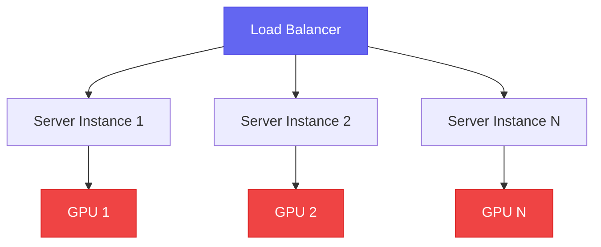

### Vertical Scaling

- Increase GPU memory for larger models
- Add more CPU cores for Vosk
- Increase RAM for model caching

---

## Future Enhancements

1. **Multi-user Support**: Session management for multiple concurrent users
2. **Recording Storage**: Optional audio/transcript storage
3. **Language Detection**: Automatic language identification
4. **Speaker Diarization**: Identify different speakers
5. **Punctuation**: Automatic punctuation insertion
6. **Custom Vocabulary**: Domain-specific word lists
7. **Real-time Translation**: Multi-language translation
8. **API Integration**: RESTful API for programmatic access

---

## References

- [Voxtral Model Card](https://huggingface.co/mistralai/Voxtral-Mini-4B-Realtime-2602)
- [vLLM Documentation](https://docs.vllm.ai/)
- [Vosk Documentation](https://alphacephei.com/vosk/)
- [Web Audio API](https://developer.mozilla.org/en-US/docs/Web/API/Web_Audio_API)
- [WebSocket Protocol](https://datatracker.ietf.org/doc/html/rfc6455)